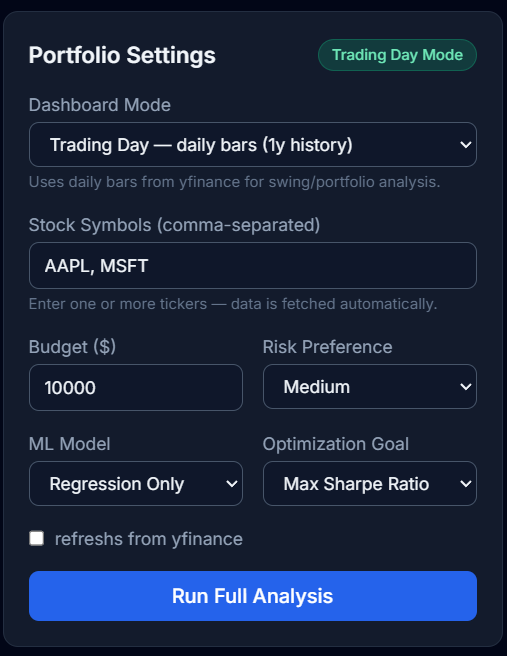
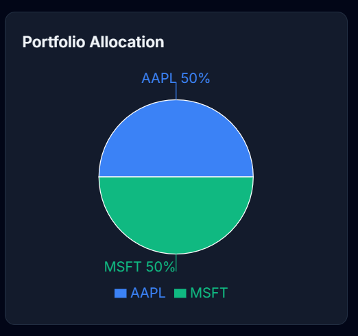

# FinOptima

## AI-Powered Portfolio Optimization System

FinOptima is an AI-driven financial analytics platform built for **OSC AI Build 1.0**, a global hackathon organized by Open Source Connect (OSC). The project combines live market data, machine learning, clustering, and portfolio optimization to help users analyze stocks and generate smart investment insights in an interactive dashboard.

---

## Dashboard Showcase

### Main Analytics Interface


###Live Price Board


### Asset Allocation Charting Panel



---

## Abstract

FinOptima is designed to showcase how open-source AI can be applied to financial decision-making. Users enter stock symbols and investment preferences, and the system fetches market data, engineers financial features, predicts short-term returns using machine learning, groups similar assets through clustering, and computes optimized portfolio allocations. The results are displayed in a clean, responsive dashboard with live prices, prediction signals, risk metrics, and allocation charts.

## Why This Project

This hackathon project focuses on building a practical AI system that is:
* **Open-source friendly** and easy to extend.
* **Demo-ready** with live and offline data modes.
* **Technically strong** with ML, optimization, and dashboard visualization.
* **Highly practical** for portfolio analysis and risk-aware investment planning.

## Objectives

* Integrate live and historical stock data using a pluggable market data provider.
* Preprocess time-series data with returns, moving averages, volatility, and RSI.
* Predict short-term returns using regression-based models and an optimized batch LSTM.
* Cluster stocks for diversification insights.
* Optimize portfolio allocations for maximum Sharpe ratio or minimum volatility.
* Present all results in a polished, hackathon-friendly dashboard.

## Methodology

1. **Data Ingestion** — Pluggable market data provider layer using `yfinance`.
2. **Preprocessing** — Clean, sort, and engineer features from raw OHLCV data.
3. **Regression Matrix** — Linear Regression + Random Forest predict next-period returns; best model selected by MAE.
4. **Batch LSTM Engine** — Sequence model on closing price/return/RSI windows running 100% in-memory via concurrent batching.
5. **Unsupervised Clustering** — KMeans clustering on return, volatility, momentum, and RSI features.
6. **Mathematical Optimization** — SciPy SLSQP execution with long-only constraints (weights sum to 1).
7. **Dashboard UI** — React + Recharts visualize allocation, risk-return scatter, trends, and data tables.

---

## Performance Note: Local vs. Cloud Deployment

* **Local Workspace (Recommended for Evaluators)**: Executes instantly (~5 to 10 seconds). It leverages your local computer's unthrottled CPU cores and high-speed memory to train model weight matrices in eager memory space rapidly.
* **Live Web Instance (https://finoptima-gts9.onrender.com)**: Processes requests within ~20- 30 seconds. Powered by an optimized, non-persistent, 100% in-memory RAM vector data pool to comply with cloud free-tier memory resource limits.

---

## Local Installation & Setup Guide

To evaluate the high-performance execution of the full optimization engine locally, spin up the modules using these terminal configurations:

### 1. Backend Server Configuration (FastAPI)
Open your terminal inside the root project directory and execute:
```bash
# Navigate to backend directory
cd backend

# Create and trigger your Python virtual environment
python -m venv venv
source venv/bin/activate  # On Windows use: venv\Scripts\activate

# Install required numerical and ML packages
pip install -r requirements.txt

# Launch the Uvicorn web server
uvicorn app.main:app --reload --port 8000
```
Your local API endpoints documentation framework will become available at `http://localhost:8000/docs`.

### 2. Frontend Interface Configuration (React + Vite)
Open a separate terminal window and launch the UI engine:
```bash
# Navigate to frontend directory
cd ../frontend

# Install modern component and utility dependencies
npm install

# Run the local Vite dev server
npm run dev
```
Dashboard hosting will begin locally at `http://localhost:5173`.

---

## Tech Stack

| Layer | Technology |
|-------|-----------|
| **Frontend** | React, Vite, Tailwind CSS, Recharts |
| **Backend** | FastAPI, Pydantic |
| **ML & Analytics Engine** | pandas, numpy, scikit-learn, scipy, TensorFlow/Keras |
| **Market Data** | yfinance |
| **Development (IDE)** | Cursor AI, VS Code |

## Project Structure

```
ai-portfolio-optimizer/
├── backend/
│   ├── app/
│   │   ├── api/routes.py          # REST endpoints
│   │   ├── services/
│   │   │   ├── market_data_service.py
│   │   │   ├── preprocessing.py
│   │   │   ├── regression_predictor.py
│   │   │   ├── lstm_predictor.py
│   │   │   ├── clustering.py
│   │   │   ├── risk_metrics.py
│   │   │   ├── optimizer.py
│   │   │   └── output_formatter.py
│   │   ├── models/schemas.py
│   │   └── utils/
│   ├── requirements.txt
│   └── run.py
├── frontend/
│   └── src/components/            # Dashboard UI components
├── sample_data/                   # Auto-generated CSV datasets
└── scripts/
```

## API Endpoints

| Method | Endpoint | Description |
|--------|----------|-------------|
| GET | `/api/health` | Health check |
| POST | `/api/live-data` | Latest market prices |
| POST | `/api/analyze` | Preprocessing + risk metrics |
| POST | `/api/predict` | ML predictions |
| POST | `/api/cluster` | Stock clustering |
| POST | `/api/optimize` | Portfolio optimization |
| POST | `/api/full-analysis` | Complete pipeline (dashboard) |


## Output format

FinOptima produces:
- Predicted returns for each asset.
- Trend signals such as upward, downward, or neutral.
- Confidence scores for predictions.
- Cluster labels for similar stocks.
- Portfolio weights and risk metrics.

## Hackathon value

This project is a strong hackathon submission because it combines:
- AI/ML
- Financial analytics.
- Real-world usability.
- Open-source extensibility.
- A visually appealing frontend demo.

## Limitations

* Free API tiers may have sudden provider request rate limits.
* Predictions are educational and do not constitute professional financial advice.
* Real-time stream data sync updates use polling in the first version instead of WebSockets.


## Future scope

- WebSocket-based live updates.
- More data providers.
- Saved portfolios and user accounts.
- Backtesting module.
- Sentiment analysis from news.
- Cloud deployment.

## AI Disclosure & Acknowledgments

FinOptima was developed efficiently during the hackathon using AI pair-programming tools (e.g., Cursor, Perplexity) for code generation, boilerplate setup, and UI styling adjustments. All core financial logic, ML routing, and system architecture were designed and engineered by the team.

## License

Built for OSC AI Build 1.0 as an open-source educational hackathon project.

This project is licensed under the MIT License - see the [LICENSE](LICENSE) file for details.

---
*Disclaimer: FinOptima is an educational hackathon project and does not constitute formal financial or investment advice.*
